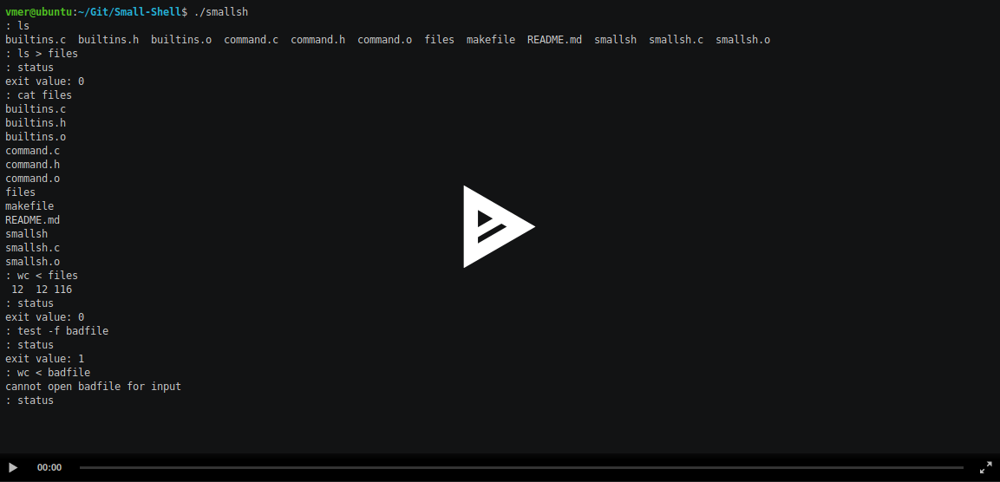

# Small Shell

<p align="center">
<a href="http://159.89.136.195:3000/a/ZFp8X61NZeybkVvFndnhCDJAr">

</a>
</p>

## Overview

Small shell is a simple custom command interpreter written in C that wraps the kernel.

## Features
- Command execution using PATH variable
- Builtins: exit, cd, and status
- Stdin and Stdout redirection
- Background and foreground processing
- Signal handling

## Assignment Link

[Small Shell](http://159.89.136.195:3000/a/ZFp8X61NZeybkVvFndnhCDJAr)

## Assignment Requirements

[Requirements](Requirements.pdf)

## Setup

```sh
make
./smallsh
```

## Improvements
- Fancier builtins
- Command completion
- Bourne again like BASH